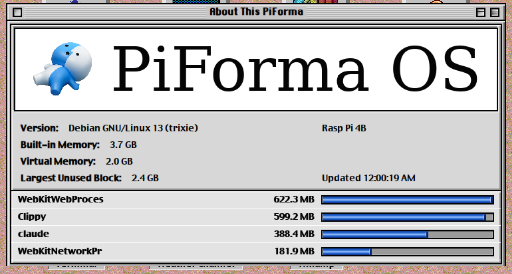

# About This PiForma Tauri

A native, frameless "About This Computer" replica for Raspberry Pi and other Linux machines. It keeps the HTML/CSS interface, but replaces the Node/Express server with Rust commands inside a Tauri app.

The app runs only while the About window is open. There is no background service and no browser chrome.

The default theme is still PiForma-branded, but it is meant to be easy to fork and retheme.




## Customize the Branding

Runtime UI copy lives in `ui/config.js`:

```js
window.ABOUT_THIS_COMPUTER_CONFIG = {
  windowTitle: 'About This PiForma',
  appTitle: 'PiForma OS',
  iconAlt: 'PiForma OS Finder-style icon',
  iconFallbackText: 'PF',
  errorMessage: 'The PiForma OS system information could not be read right now.',
  loadErrorMessage: 'Sorry, About This PiForma OS cannot read system information.',
  hardwareLabels: {
    'Raspberry Pi 4 Model B Rev 1.5': 'Rasp Pi 4B'
  }
};
```

Replace `ui/assets/finder-guy.png` to change the large system icon.

Build/package metadata is in:

- `package.json` for the npm package name.
- `src-tauri/Cargo.toml` for the Rust package name, description, and authors.
- `src-tauri/tauri.conf.json` for the installed app name, bundle identifier, window title, package descriptions, and bundle targets.

The Rust command also has a compile-time fallback for the system name. Most forks only need `ui/config.js`, but you can override the Rust fallback with:

```bash
ABOUT_THIS_COMPUTER_SYSTEM_NAME="My Linux Box" npm run build
```

## Raspberry Pi Setup

Install Linux build prerequisites:

```bash
sudo apt update
sudo apt install build-essential curl libwebkit2gtk-4.1-dev libgtk-3-dev libayatana-appindicator3-dev librsvg2-dev
```

Install Rust:

```bash
curl --proto '=https' --tlsv1.2 -sSf https://sh.rustup.rs | sh
```

Install Node/npm only for the Tauri CLI wrapper:

```bash
sudo apt install nodejs npm
```

Install project dependencies:

```bash
npm install
```

Run it during development:

```bash
npm run dev
```

Build a package:

```bash
npm run build
```

The `.deb` and AppImage outputs will be under:

```text
src-tauri/target/release/bundle/
```

## Notes

- The window is undecorated, fixed size, and transparent so only the drawn about window is visible.
- The close button calls a native Tauri command and exits the app process.
- System stats are read directly from `/etc/os-release`, `/proc`, `/sys`, and device tree metadata when present.
- The stat/process text uses `ui/assets/fonts/Charcoal.ttf` when present. If you have a licensed Charcoal font, place it there before building.

## License

Released under the [MIT License](LICENSE).
